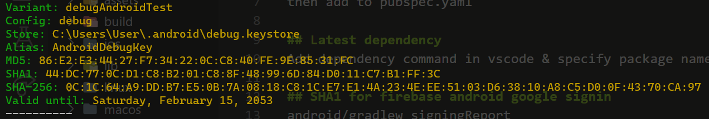

divide functionalities into features 
each feature has repository, controller & screens 
  prevent logic inside UI 

## Image assets
add to assets/images/..
then add to pubspec.yaml

## Latest dependency
Add dependency command in vscode & specify package names 

## SHA1 for firebase android google signin
android/gradlew signingReport

Copypaste to firebase settings

then download & replace google-services.json in android/app/


# Firebase google sign in
## Auth repository
let user sign into their google account
get credentials from it (accessToken, idToken)
login with firebase with those tokens

## Auth controller
has repository and use its functions
deal with errors raised from above 

## Providers 
instead of using singletons, we can use provider for global variables (no need to create instances every time)

do this for repository, controller, even firebase stuff 

### Use provider inside other provider
use `ref`
- `.read()`: get once
- `.watch()`: used inside build context to listen for changes(?)

## Sign in button logic
sign in with google button can be used in different places, so logic should be with button

to use providers in widget, turn it into `ConsumerWidget`

add `WidgetRef` to build function and pass it to whichever function (ex: onPressed) needs it

### Provider scope
tells flutter where providers are available(?)
wrap `MyApp` with `ProviderScope`


# Storing data in firestore
Create firestore db in console

create `UserModel` and generate data class (with extension from hzgood)

How to store data to firestore:
1. Get CollectionReference
2. Get DocumentReference
3. Pass map or map representation of your model to `.set()` 

> `set()` overwrites existing data!
> only save user if is new(?)
> can check newness via `UserCredential` returned from `signInWithCredential()`


# Efficient exception handling
use `fpdart` package, provides error in function definition(?)

Using `Either<Error, SuccessType>`, can `fold` to work on fail and success cases(?)

`typedef FutureEither<T> = Future<Either<Failure, T>>;` is even like Result<T> in most Rust codebases where the fail class is the same across the board! I'm glad I learnt rust. 

Returns need to be put inside `left()` & `right()` functions

## Snackbar
Dart has `..` syntax for you to call methods on the same object without repeating the object name. Can basically chain call methods. Reminds me of functional programming. 

Alternative to showing a modal upon some action or error(?). 
```dart
void showSnackBar(BuildContext context, String text) {
  ScaffoldMessenger.of(context)
    ..hideCurrentSnackBar()
    ..showSnackBar(SnackBar(content: Text(text)));
}
```

## Stream user data
If user is not new, get from firestore. 

Why stream instead of get: see realtime changes(?)

```dart
Stream<UserModel> getUserData(String uid) {
  return _users
      .doc(uid)
      .snapshots()
      .map((event) => UserModel.fromMap(event.data() as Map<String, dynamic>));
}
```
Map the returned data into `UserModel`s


# Storing data to provider
`Provider` from riverpod is like read-only global data. if want <del>mutable</del>**changeable?**, use `StateProvider`. 

Put userProvider with authController 
To use ref in authController, add it to contructor
Ref in controller is from when you create a `Provider`

How to read and change `StateProvider`:
`_ref.read(userProvider.notifier).update((state) => userModel)`

If you don't use `.notifier`, it will return the current state. 

## StateNotifier
observable class, stores single immutable state 

used with `StateNotifierProvider` to expose the state(?)
> for some reason, `StateProvider` is a simple version of this??

This is extended by `AuthController`, so that we can tell if the controller is busy doing something, loading. 

Extending this, we can add more logic, methods... Can't do this with the simple `StateProvider`.

**ISSUE**: because LoginScreen rebuilds based on isLoading state of AuthController, the BuildContext is nuked. I can't use that context for showing snackbar. Solution is to use some kind of:
`GlobalKey<ScaffoldMessengerState> scaffoldMessengerKey = GlobalKey<ScaffoldMessengerState>();`


# Flutter route management 
